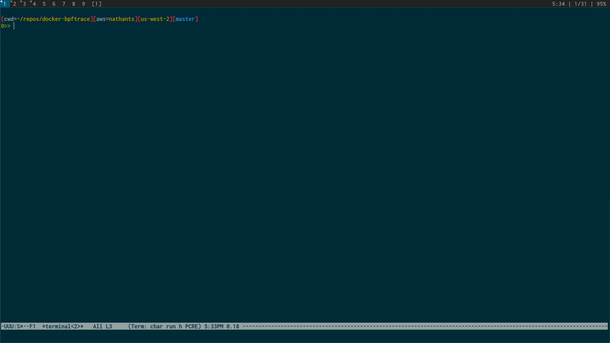

## what

analyze and minimize the filesystem of a container

## why

containers have too much stuff in them

## install

```
>> go get github.com/nathants/docker-trace
```

## usage

```
>> docker-trace -h

dockerfile - scan a container and print the dockerfile
files      - bpftrace filesystem access in a running container
minify     - minify a container keeping files passed on stdin
scan       - scan a container and list filesystem contents
unpack     - unpack a container into directories and files
```

## example



## usage

```
>> docker create -it --rm archlinux bash # terminal 1
>> docker-trace files $container_id      # terminal 2
>> docker start -ia $container_id        # terminal 1
```

## minification

```
>> docker create -it --rm archlinux bash                                                 # terminal 1
>> docker-trace files $container_id | docker-trace minify archlinux:latest archlinux:min # terminal 2
>> docker start -ia $container_id                                                        # terminal 1
```

## minification results from tests

```
>> docker images | grep web | sort | awk '{print $2 " " $7}'| column -t

minify-go-web-alpine-026be0e909d25e2e5019bf9a8e0047c0           468MB
minify-go-web-alpine-026be0e909d25e2e5019bf9a8e0047c0-min       7.1MB

minify-go-web-amzn-026be0e909d25e2e5019bf9a8e0047c0             1.1GB
minify-go-web-amzn-026be0e909d25e2e5019bf9a8e0047c0-min         9MB

minify-go-web-arch-026be0e909d25e2e5019bf9a8e0047c0             1GB
minify-go-web-arch-026be0e909d25e2e5019bf9a8e0047c0-min         8.95MB

minify-go-web-debian-026be0e909d25e2e5019bf9a8e0047c0           846MB
minify-go-web-debian-026be0e909d25e2e5019bf9a8e0047c0-min       8.82MB

minify-go-web-ubuntu-026be0e909d25e2e5019bf9a8e0047c0           703MB
minify-go-web-ubuntu-026be0e909d25e2e5019bf9a8e0047c0-min       9.9MB

minify-node-web-alpine-88fcdb538a144d54ec41b967f54c5e70         59.9MB
minify-node-web-alpine-88fcdb538a144d54ec41b967f54c5e70-min     44.1MB

minify-node-web-amzn-88fcdb538a144d54ec41b967f54c5e70           528MB
minify-node-web-amzn-88fcdb538a144d54ec41b967f54c5e70-min       53.1MB

minify-node-web-arch-88fcdb538a144d54ec41b967f54c5e70           609MB
minify-node-web-arch-88fcdb538a144d54ec41b967f54c5e70-min       94.3MB

minify-node-web-debian-88fcdb538a144d54ec41b967f54c5e70         960MB
minify-node-web-debian-88fcdb538a144d54ec41b967f54c5e70-min     81.3MB

minify-node-web-ubuntu-88fcdb538a144d54ec41b967f54c5e70         655MB
minify-node-web-ubuntu-88fcdb538a144d54ec41b967f54c5e70-min     66.7MB

minify-python3-web-alpine-3255592eda8a6eede400c674466b5e4b      84.2MB
minify-python3-web-alpine-3255592eda8a6eede400c674466b5e4b-min  15.8MB

minify-python3-web-amzn-3255592eda8a6eede400c674466b5e4b        645MB
minify-python3-web-amzn-3255592eda8a6eede400c674466b5e4b-min    21.9MB

minify-python3-web-arch-3255592eda8a6eede400c674466b5e4b        681MB
minify-python3-web-arch-3255592eda8a6eede400c674466b5e4b-min    23.9MB

minify-python3-web-debian-3255592eda8a6eede400c674466b5e4b      567MB
minify-python3-web-debian-3255592eda8a6eede400c674466b5e4b-min  20.3MB

minify-python3-web-ubuntu-3255592eda8a6eede400c674466b5e4b      459MB
minify-python3-web-ubuntu-3255592eda8a6eede400c674466b5e4b-min  20.2MB
```
